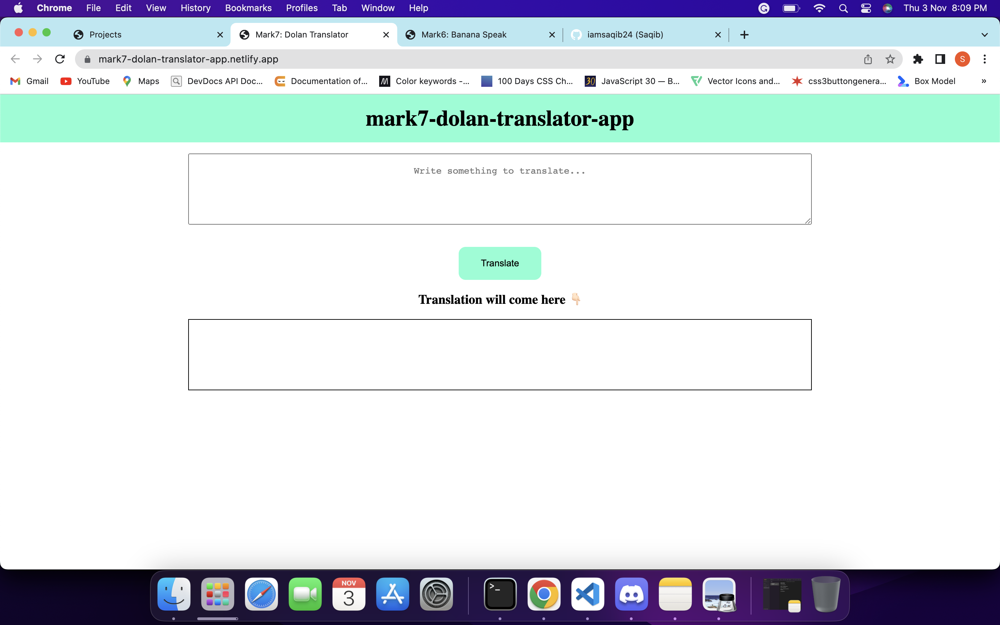

# Mark7-Donal-Translator-App

This is the simple translation app. It takes input from the user and convert the given input into Donal's language. To build this fun translation app, i have used third party api. Which is freely available to use.

## Technologies i used to build this:

1. HTML
2. CSS
3. JavaScript
4. Third Party API

## Project is live, to check [click here](https://mark7-dolan-translator-app.netlify.app/ "Donal-Translate")

## Image:

